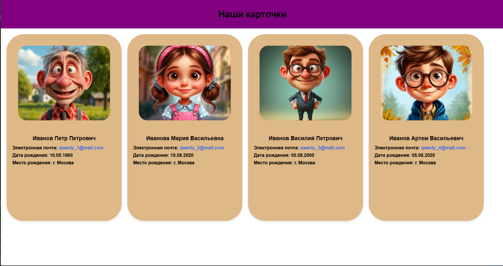

# файл VD-02 # Проект: Интерактивные персональные карточки

![Пример карточки]

Веб-страница с анимированными карточками персонажей, отображающими персональную информацию.

## Особенности ✨
- 🎨 Плавные анимации при наведении
- 📱 Адаптивная верстка с Flexbox
- 📌 4 уникальные карточки с персонажами
- ✉️ Рабочие email-ссылки с mailto
- 🌈 Динамические эффекты:
  - Подъем карточки при наведении
  - Увеличение фотографии
  - Изменение цвета фона
  - Анимация текста
- 📷 Оптимизированное отображение изображений
- 🖱 Интерактивные состояния ссылок

## Технологии 🛠


## Быстрый старт 🚀
1. Клонируйте репозиторий:
```bash
git clone https://github.com/ваш-username/название-репозитория.git
Структура файлов:

project/
├── VD_02.html
├── images/
│   ├── старик.jpeg
│   ├── девочка.jpeg
│   ├── персонаж.jpeg
│   └── мальчик.jpeg
└── README.md
Откройте VD_02.html в браузере

Кастомизация 🎛
Чтобы изменить контент:

Добавьте свои изображения в папку images/

Обновите HTML-структуру карточек:

html
<div class="card">
    <div class="photo">
        
    </div>
    <div class="name">
        <h1>Ваше Имя</h1>
        <h2>E-mail: <a href="mailto:ваш@email.com">ваш@email.com</a></h2>
        <h2>Дата рождения: ДД.ММ.ГГГГ</h2>
        <h2>Место рождения: Город</h2>
    </div>
</div>
Стилизация 🖌
Основные параметры для настройки:

css
.card {
    width: 400px; /* Ширина карточки */
    height: 650px; /* Высота карточки */
    background-color: burlywood; /* Основной цвет фона */
    border-radius: 60px; /* Скругление углов */
}

.card:hover {
    transform: translateY(-10px) scale(1.02); /* Эффект подъема */
    background-color: #d2a679; /* Цвет фона при наведении */
}
Лицензия 📄
MIT License | Подробнее


